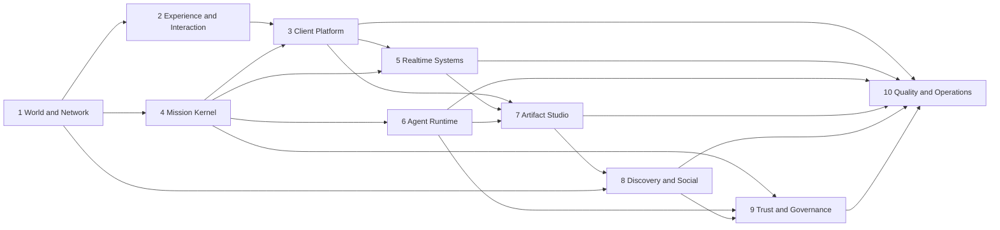

# Realworld A-to-Z Program

This is the execution map for building Realworld as a production multiplayer work world for one to fifty humans and autonomous agents. Teams are persistent ownership lanes, not temporary feature squads. Work enters a lane only when its dependencies and release gates are satisfied.

## Operating model

- Model for delegated implementation and research: GPT-5.6 Terra.
- Maximum active local workers: three plus the coordinator. Teams rotate through those slots by dependency priority.
- Convex is authoritative for durable state. Ably carries disposable presence, cursor, selection, voice-adjacent signals, and other high-frequency room telemetry.
- Each team heartbeat records a state change, evidence, blocker, or exact next action. No-op heartbeats are stored silently and do not notify the founder.
- A team may not edit outside its declared scope without a coordinator handoff.
- “Done” requires the evidence named in `BUILD_LEDGER.md`; a commit or screenshot alone is not completion.

## Ten teams

| # | Team | Owns | Depends on | First production outcome |
| --- | --- | --- | --- | --- |
| 1 | World & Network Systems | Core loop, Missions, room ecology, solo-to-50 scaling, invitation loops | None | A complete first-session and return loop |
| 2 | Experience & Interaction | Mission World map, room interiors, motion, sound, accessibility, design system | Team 1 | Approved world and room interaction specification |
| 3 | Client Platform | Next.js shell, rendering, navigation, responsive behavior, client state | Teams 1–2 | Signed-in production shell matching the approved direction |
| 4 | Mission Kernel | Convex schema, auth, roles, Missions, Moves, event ledger | Team 1 | One user completes a Mission with replayable history |
| 5 | Realtime Systems | Ably presence, cursors, selections, room transitions, reconnect behavior | Teams 3–4 | Two users share consistent durable and ephemeral state |
| 6 | Agent Runtime | Agent identities, OpenAI Agents SDK control plane, OpenRouter/DeepSeek adapter, tools, budgets | Team 4 | A bounded agent creates an attributable Artifact |
| 7 | Artifact Studio | Collaborative artifacts, comments, versions, branches, merge, search | Teams 3–6 | A mixed team ships a substantive digital deliverable |
| 8 | Discovery & Social | Calls, joining, following, Proof, reputation, notifications, network growth | Teams 1, 4, 7 | A stranger discovers and makes a useful contribution |
| 9 | Trust & Governance | Permissions, autonomy controls, moderation, privacy, audit, abuse resistance | Teams 4, 6, 8 | Adversarial permission and agent-safety gates pass |
| 10 | Quality & Operations | CI, tests, observability, load, cost, Vercel, recovery, release management | All teams | Staged production release with rehearsed rollback |

## Dependency flow

## Execution waves

### Wave A — Constitution

Teams 1, 6, and 9/10 specify the product loop, platform boundaries, agent safety, and release gates. Team 2 converts the selected Living Atlas hybrid into a Mission World map plus at least one room interior.

### Wave B — Foundation

Teams 3, 4, and 10 establish the application, design system, Convex/auth foundation, test infrastructure, observability, preview deployment, and environment validation.

### Wave C — Multiplayer kernel

Teams 4 and 5 deliver Missions, membership, event history, presence, room transitions, reconnection, and simultaneous interaction. Team 9 attacks the permission model continuously.

### Wave D — Autonomous collaborators

Teams 6 and 7 deliver resumable agents, tool permissions, Artifact production, proposals, versions, branches, and merges.

### Wave E — Network and world

Teams 1, 2, 7, and 8 deliver public discovery, Calls, contribution reputation, Surges, room ecology, rituals, and return loops grounded in useful work.

### Wave F — Production maturity

Teams 9 and 10 run adversarial, accessibility, multi-user, load, failure, recovery, cost, and staged-release gates. The public launch remains gated until rollback and data recovery are rehearsed.

## Heartbeat contract

Every team record has:

- `status`: queued, active, waiting, blocked, review, or complete.
- `lastMeaningfulHeartbeatAt`: updated only when something changes.
- `evidence`: commit, test result, preview, decision, or reproducible finding.
- `exactNextAction`: one bounded action another worker can execute.
- `blocker`: the precise missing decision, access, dependency, or failure.

The coordinator checks active teams every fifteen minutes, dispatches newly unblocked work, and reports only phase completion, decisions, new blockers, or release gates. When every Phase 8 exit gate passes, the coordinator disables its own heartbeat.

